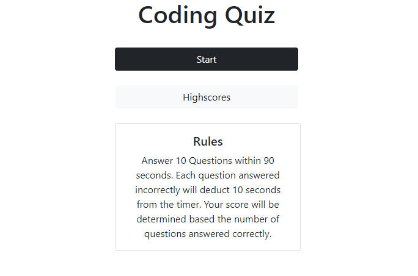

# Code-Quiz
Bootcamp Homework 4 - Coding Bootcamp Timed Quiz
Application that quizzes the user, prompting them questions that should test their coding knowledge on a timer. If a question is answered wrong, a 10 seconds will reduced from the timer. The user's score is based on how many questions were answered correctly.

https://aseppala98.github.io/Code-Quiz/Develop/index.html

